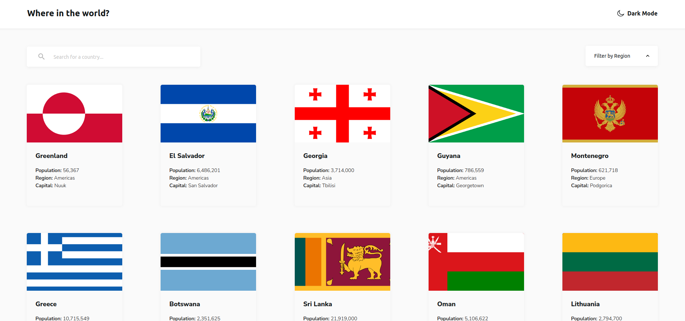

# Frontend Mentor - REST Countries API with color theme switcher solution

This is a solution to the [REST Countries API with color theme switcher challenge on Frontend Mentor](https://www.frontendmentor.io/challenges/rest-countries-api-with-color-theme-switcher-5cacc469fec04111f7b848ca). Frontend Mentor challenges help you improve your coding skills by building realistic projects.

## Table of contents

- [Overview](#overview)
  - [The challenge](#the-challenge)
  - [Screenshot](#screenshot)
  - [Links](#links)
- [My process](#my-process)
  - [Built with](#built-with)
  - [What I learned](#what-i-learned)
  - [Continued development](#continued-development)
- [Author](#author)
- [Acknowledgments](#acknowledgments)
- [Run Project](#how-to-run-project)

## Overview

### The challenge

Users should be able to:

- See all countries from the API on the homepage
- Search for a country using an `input` field
- Filter countries by region
- Click on a country to see more detailed information on a separate page
- Click through to the border countries on the detail page
- Toggle the color scheme between light and dark mode *(optional)*

### Screenshot



### Links

- Solution URL: [Solution](https://www.frontendmentor.io/solutions/vue-3-compositionapi-tailwindcss-pinia-vue-router-5is1IiuBYE)
- Live Site URL: [Live](https://delicate-lollipop-e8af06.netlify.app/)

## My process

### Built with

- Semantic HTML5 markup
- [TailwindCSS](https://tailwindcss.com/) - CSS Framework
- Mobile-first workflow
- [Vue.js](https://vuejs.org/) - front-end framework Vue3 | Composition API
- [Jest](https://jestjs.io/) - for unit testing
- [Pinia](https://pinia.vuejs.org/) - Vue 3 state management library
- [Cypress](https://www.cypress.io/) - for end to end testing

### What I learned

Mastering Vue <3

### Continued development

I want to complete these challenges using vue :)

## Author

- Github - [Mikołaj Szymczuk](https://github.com/mikolajszymczuk1)
- Frontend Mentor - [@mikolajszymczuk1](https://www.frontendmentor.io/profile/mikolajszymczuk1)

## Acknowledgments

```js
LOVE VUE <3
```

## Recommended IDE Setup

[VSCode](https://code.visualstudio.com/) + [Volar](https://marketplace.visualstudio.com/items?itemName=Vue.volar) (and disable Vetur) + [TypeScript Vue Plugin (Volar)](https://marketplace.visualstudio.com/items?itemName=Vue.vscode-typescript-vue-plugin).

## Customize configuration

See [Vite Configuration Reference](https://vitejs.dev/config/).

## Project Setup

```sh
npm install
```

### Compile and Hot-Reload for Development

```sh
npm run dev
```

### Compile and Minify for Production

```sh
npm run build
```

### Run Unit Tests with [Vitest](https://vitest.dev/)

```sh
npm run test:unit
```

### Run End-to-End Tests with [Cypress](https://www.cypress.io/)

```sh
npm run build
npm run test:e2e # or `npm run test:e2e:ci` for headless testing
```

### Lint with [ESLint](https://eslint.org/)

```sh
npm run lint
```
